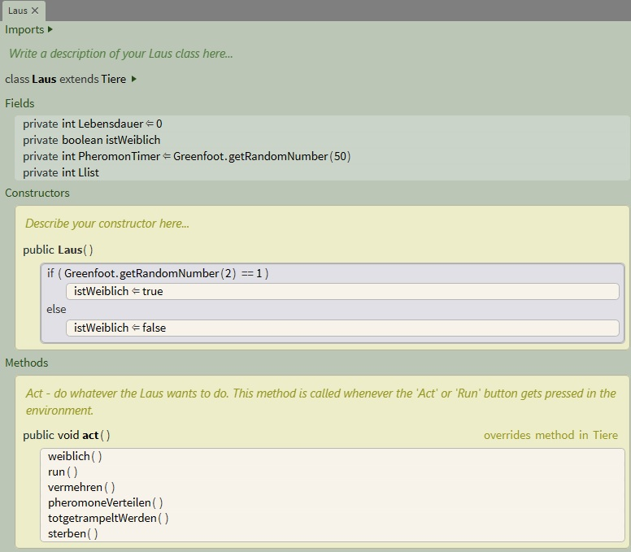
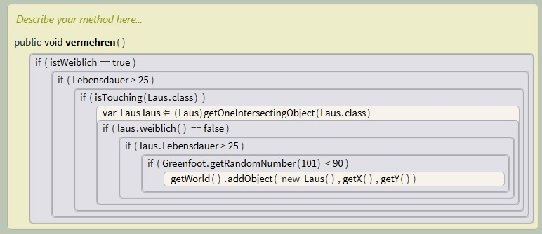

<h1 style="color:Navy;"><a id="Übe"><b>Stride Aktivitäten Krull+Tiedemann</b></a></h1>

Informatik bei Herrn Buhl, 4. Halbjahr Qualifikationsphase

<a href="https://marliskrull.github.io/Stundenprotokoll_2/">Hier geht's zu unserem Stundenprotokoll!</a>

 
<h1 style="color:CadetBlue;"><b>Ladybug Quest</b></h1>

Bitte entnehmen Sie unsere Räuber-Beute Simulation "Ladybug Quest" dem Informatikordner auf iSurfStormarn.

    
<h2 style="color:Navy;">Gliederung</h2>

<ul style="color:CadetBlue;">
      <li><a href="#Bio">1. Biologische Grundlagen </a></li>
      <li><a href="#Lot">1.1 "Lotka-Volterra-Regeln"</a></li>
      <li><a href="#Sim">2. Simulationsentwicklung</a></li>
      <li><a href="#Ide">2.2 Ideen</a></li>
      <li><a href="#Imp">2.3 Implementierung</a></li>
      <li><a href="#Wei">3. Weitere Entwicklungsideen</a></li>   
    </ul>

<h2 style="color:Navy;"><a id="Bio">Biologische Grundlagen</a></h2>

 

<h3 style="color:Navy;"><a id="Lot">"Lotka-Volterra-Regeln"</a></h3>

 Die Lotka-Volterra-Regeln, auch Lotka-Volterra-Gesetze oder nur Volterra-Regeln genannt, umfassen drei Regeln zur quantitativen Beschreibung der Populationsdynamik in Räuber-Beute-Beziehungen. 

<ul style="color:CadetBlue;">
<li>Erste Lotka-Volterra-Regel (Periodische Populationsschwankung): Die Populationsgrößen von Räuber und Beute schwanken periodisch. Dabei folgen die Schwankungen der Räuberpopulation phasenverzögert denen der Beutepopulation. Die Länge der Perioden hängt von den Anfangsbedingungen und von den Wachstumsraten der Populationen ab.</li>
<li>Zweite Lotka-Volterra-Regel (Konstanz der Mittelwerte): Die über genügend lange Zeiträume gemittelten Größen (Mittelwert) der Räuber- bzw. Beutepopulation sind konstant. Die Größe der Mittelwerte hängt nur von den Wachstums- und Rückgangsraten der Populationen, nicht aber von den Anfangsbedingungen ab.</li>
<li>Dritte Lotka-Volterra-Regel (Störung der Mittelwerte): Werden Räuber- und Beutepopulation gleichermaßen proportional zu ihrer Größe dezimiert, so vergrößert sich kurzfristig der Mittelwert der Beutepopulation, während der Mittelwert der Räuberpopulation kurzfristig sinkt.</li>
</ul>

Die Lotka-Volterra-Regeln sind strenggenommen nur unter Beachtung ihrer selten erfüllten Voraussetzungen anwendbar. Trotzdem sind sie in der praktischen Ökologie von großer Bedeutung, weil sich zeigt, dass sie auch bei komplexeren Nahrungsbeziehungen und schwankenden Umweltfaktoren durchaus noch brauchbare Abschätzungen liefern.

<a href="https://de.wikipedia.org/wiki/Lotka-Volterra-Regeln"> Quelle </a> 

Für weitere Informationen zu den Lotka-Volterra-Regeln, siehe:   
<a href="https://de.wikipedia.org/wiki/Lotka-Volterra-Regeln">https://de.wikipedia.org/wiki/Lotka-Volterra-Regeln</a>

<h2 style="color:Navy;"><a id="Sim">Simulationsentwicklung</a></h2>

<h3 style="color:Navy;"><a id="Ide">Ideen</a></h3>

<h3 style="color:Navy;"><a id="Imp">Implementierung</a></h3>

<ul style="color:CadetBlue;">
      <li><a href="#Lau">Die Laus-Klasse </a></li>
      <li><a href="#Käf">Die Käfer-Klasse"</a></li>
      <li><a href="#Phe">Die Pheromone-Klasse</a></li>
      <li><a href="#Gra">Der Graph</a></li>
    </ul>

<h4 style="color:CadetBlue;"><a id="Lau">Die Laus-Klasse</a></h4>

Die act-Methode der Laus-Klasse enthält 6 Methoden, die im Folgenden detailliert beschrieben werden.  
Um das Geschlecht der Laus festzulegen, wird eine Variable "istWeiblich" vom Typ boolean erstellt. Diese wird im Constructor zu einer 50%-igen Wahrscheinlichkeit auf true gesetzt, andernfalls ist sie false. Die Laus ist also entweder weiblich, oder nicht weiblich, also männlich.

Diese Fragemethode gibt den Wert vom boolean "istWeiblich" wieder.

Dies ist die Bewegungsmethode der Laus.  
Die Laus läuft konstant mit einer Geschwindigkeit von 5 Pixel/Tic über den Bildschirm und dreht sich mit je einer Wahrscheinlichkeit von 2,5 % entweder um 45, 90, 180 oder 270 Grad im Uhrzeigersinn. Wenn die Laus am Rand der Welt angekommen ist, dreht sie sich um 180 Grad.  
Mit diesem Bewegungsmuster bewegt sich die Laus nach einer Weile regelmäßig über den gesamten Bildschirm. 

Mit dieser Methode vermehrt sich die Laus.  
Wenn eine Laus, die weiblich ist und eine höhere Lebensdauer als 25 hat, eine andere Laus berührt, wird für diese eine Variable "laus" erstellt. Wenn "laus" nicht weiblich ist und ebenfalls eine höhere Lebensdauer als 25 hat, wird zu einer Wahrscheinlichkeit von 90 % eine neue Laus an der Position der beiden Läuse in die Welt gesetzt. 

Mit dieser Methode verteilt die Laus Pheromone, die die Käfer anlocken sollen. 
Dazu wurde eine Variable "PheromonTimer" vom Typ integer erstellt, die mit jedem Tic um 1 erhöht wird. Diese wird am Anfang randomisiert, sodass die Läuse nicht alle zum selben Zeitpunkt Pheromone fallen lassen. Wenn der PheromonTimer bei 50 angelangt ist, wird ein neues Pheromon an der aktuellen Position der Laus eingefügt und der PheromonTimer wieder auf 0 gesetzt.

Diese Methode simuliert die Konkurrenz zwischen den einzelnen Läusen. 
Sie erstellt eine Variable "list", die eine Liste von allen Läusen im Umkreis von 100 Pixeln enthält. Die Variable "Llist" vom Typ integer entspricht der Anzahl der Läusen auf dieser Liste. Wenn die Anzahl größer als 55 ist, wird eine zufällige Laus von der Liste aus der Welt entfernt. Dies soll verhindern, dass sich die Läuse übermäßig vermehren.

Diese Methode lässt die Laus nach einer gewissen Lebensdauer sterben. 
Hierfür wird eine Variable "Lebensdauer" vom Typ integer erstellt, die mit jedem Tic um 1 erhöht wird. Nach 100 Tics stirbt die Laus und wird aus der Welt entfernt

<h4 style="color:CadetBlue;"><a id="Käf"> Die Käfer-Klasse </a></h4>

<h4 style="color:CadetBlue;"><a id="Phe">Die Pheromone-Klasse</a></h4>

<h4 style="color:CadetBlue;"><a id="Gra">der Graph</a></h4>

<h2 style="color:Navy;"><a id="Wei">Weitere Entwicklungsideen</a></h2>

<a href="#Übe">zum Seitenanfang</a>

