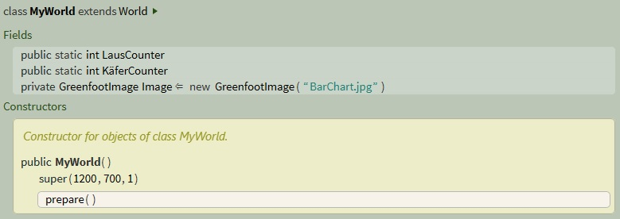
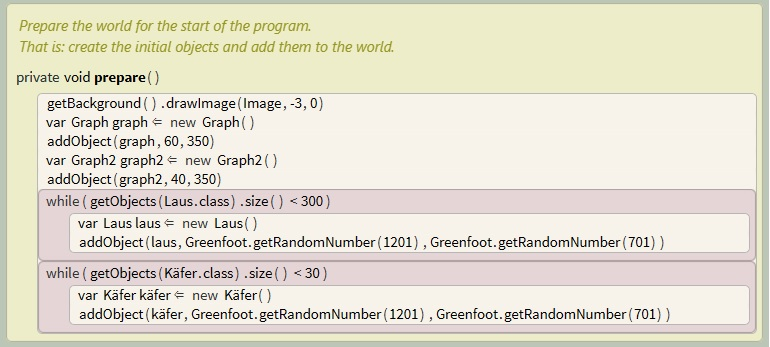

<h1 style="color:Navy;"><a id="Übe"><b>Stride Aktivitäten Krull+Tiedemann</b></a></h1>

Informatik bei Herrn Buhl, 4. Halbjahr Qualifikationsphase

<a href="https://marliskrull.github.io/Stundenprotokoll_2/">Hier geht's zu unserem Stundenprotokoll!</a>

 
<h1 style="color:CadetBlue;"><b>Ladybug Quest</b></h1>

Bitte entnehmen Sie unsere Räuber-Beute Simulation "Ladybug Quest" dem Informatikordner auf iSurfStormarn.

    
<h2 style="color:Navy;">Gliederung</h2>

<ul style="color:CadetBlue;">
      <li><a href="#Bio">1. Biologische Grundlagen </a></li>
      <li><a href="#Lot">1.1 "Lotka-Volterra-Regeln"</a></li>
      <li><a href="#Sim">2. Simulationsentwicklung</a></li>
      <li><a href="#Ide">2.2 Ideen</a></li>
      <li><a href="#Imp">2.3 Implementierung</a></li>
      <li><a href="#Wei">3. Weitere Entwicklungsideen</a></li>   
    </ul>

<h2 style="color:Navy;"><a id="Bio">Biologische Grundlagen</a></h2>

 

<h3 style="color:Navy;"><a id="Lot">"Lotka-Volterra-Regeln"</a></h3>

 Die Lotka-Volterra-Regeln, auch Lotka-Volterra-Gesetze oder nur Volterra-Regeln genannt, umfassen drei Regeln zur quantitativen Beschreibung der Populationsdynamik in Räuber-Beute-Beziehungen. 

<ul style="color:CadetBlue;">
<li>Erste Lotka-Volterra-Regel (Periodische Populationsschwankung): Die Populationsgrößen von Räuber und Beute schwanken periodisch. Dabei folgen die Schwankungen der Räuberpopulation phasenverzögert denen der Beutepopulation. Die Länge der Perioden hängt von den Anfangsbedingungen und von den Wachstumsraten der Populationen ab.</li>
<li>Zweite Lotka-Volterra-Regel (Konstanz der Mittelwerte): Die über genügend lange Zeiträume gemittelten Größen (Mittelwert) der Räuber- bzw. Beutepopulation sind konstant. Die Größe der Mittelwerte hängt nur von den Wachstums- und Rückgangsraten der Populationen, nicht aber von den Anfangsbedingungen ab.</li>
<li>Dritte Lotka-Volterra-Regel (Störung der Mittelwerte): Werden Räuber- und Beutepopulation gleichermaßen proportional zu ihrer Größe dezimiert, so vergrößert sich kurzfristig der Mittelwert der Beutepopulation, während der Mittelwert der Räuberpopulation kurzfristig sinkt.</li>
</ul>

Die Lotka-Volterra-Regeln sind strenggenommen nur unter Beachtung ihrer selten erfüllten Voraussetzungen anwendbar. Trotzdem sind sie in der praktischen Ökologie von großer Bedeutung, weil sich zeigt, dass sie auch bei komplexeren Nahrungsbeziehungen und schwankenden Umweltfaktoren durchaus noch brauchbare Abschätzungen liefern.

<a href="https://de.wikipedia.org/wiki/Lotka-Volterra-Regeln"> Quelle </a> 

Für weitere Informationen zu den Lotka-Volterra-Regeln, siehe:   
<a href="https://de.wikipedia.org/wiki/Lotka-Volterra-Regeln">https://de.wikipedia.org/wiki/Lotka-Volterra-Regeln</a>

<h2 style="color:Navy;"><a id="Sim">Simulationsentwicklung</a></h2>

<h3 style="color:Navy;"><a id="Ide">Ideen</a></h3>

<h3 style="color:Navy;"><a id="Imp">Implementierung</a></h3>

<ul style="color:CadetBlue;">
<li><a href="#Wor">MyWorld </a></li>
      <li><a href="#Lau">Die Laus-Klasse </a></li>
      <li><a href="#Käf">Die Käfer-Klasse"</a></li>
      <li><a href="#Phe">Die Pheromone-Klasse</a></li>
      <li><a href="#Gra">Der Graph</a></li>
    </ul>

<h4 style="color:CadetBlue;"><a id="Wor">MyWorld</a></h4>

Die Welt ist 1200 x 700 Zellen groß und 1 Pixel entspricht der Größe einer Zelle.

Die "prepare"-Methode der Welt setzt zu Anfang des Szenarios einen Graph, einen Graph 2, 300 Läuse und 30 Käfer in die Welt.  
Die Käfer und Läuse werden mit einer While-Schleife generiert. Solange weniger als 300 Läuse bzw. weniger als 30 Käfer in der Welt sind, werden jeweils neue hinzugefügt. 
Außerdem wird noch das Bild "BarChart.jpg" auf die linken Seite des Hintergrunds gezeichnet.

Die act-Methode der MyWorld enthält nur die Methode "countActors". Diese erstellt jeweils eine Liste ("Lauslist" und "Käferlist") von allen Läusen/Käfern in der Welt. Die Variablen <a id="LauC">"LausCounter"</a> und <a id="KäfC">"KäferCounter"</a> vom Typ integer enthalten jeweils die Anzahl der Läuse/Käfer auf der "Lausliste"/"Käferliste". Sie ist public und kann daher von den Actors Graph und Graph2 abgerufen werden.

<h4 style="color:CadetBlue;"><a id="Lau">Die Laus-Klasse</a></h4>

Die act-Methode der Laus-Klasse enthält 6 Methoden, die im Folgenden detailliert beschrieben werden.  
Um das Geschlecht der Laus festzulegen, wird eine Variable "istWeiblich" vom Typ boolean erstellt. Diese wird im Constructor zu einer 50%-igen Wahrscheinlichkeit auf true gesetzt, andernfalls ist sie false. Die Laus ist also entweder weiblich, oder nicht weiblich (=männlich).

Diese Fragemethode gibt den Wert vom boolean "istWeiblich" wieder.

Dies ist die Bewegungsmethode der Laus.  
Die Laus läuft konstant mit einer Geschwindigkeit von 5 Pixel/Tic über den Bildschirm und dreht sich mit je einer Wahrscheinlichkeit von 2,5 % entweder um 45, 90, 180 oder 270 Grad im Uhrzeigersinn. Wenn die Laus am Rand der Welt angekommen ist, dreht sie sich um 180 Grad.  
Mit diesem Bewegungsmuster bewegt sich die Laus nach einer Weile regelmäßig über den gesamten Bildschirm. 

Mit dieser Methode vermehrt sich die Laus.  
Wenn eine Laus, die weiblich ist und eine höhere Lebensdauer als 25 hat, eine andere Laus berührt, wird für diese eine Variable "laus" erstellt. Wenn "laus" nicht weiblich ist und ebenfalls eine höhere Lebensdauer als 25 hat, wird zu einer Wahrscheinlichkeit von 90 % eine neue Laus an der Position der beiden Läuse in die Welt gesetzt. 

Mit dieser Methode verteilt die Laus Pheromone, die die Käfer anlocken sollen. 
Dazu wurde eine Variable "PheromonTimer" vom Typ integer erstellt, die mit jedem Tic um 1 erhöht wird. Diese wird am Anfang randomisiert, sodass die Läuse nicht alle zum selben Zeitpunkt Pheromone fallen lassen. Wenn der PheromonTimer bei 50 angelangt ist, wird ein neues Pheromon an der aktuellen Position der Laus eingefügt und der PheromonTimer wieder auf 0 gesetzt.

Diese Methode simuliert die Konkurrenz zwischen den einzelnen Läusen. 
Sie erstellt eine Variable "list", die eine Liste von allen Läusen im Umkreis von 100 Pixeln enthält. Die Variable "Llist" vom Typ integer entspricht der Anzahl der Läusen auf dieser Liste. Wenn die Anzahl größer als 55 ist, wird eine zufällige Laus von der Liste aus der Welt entfernt. Dies soll verhindern, dass sich die Läuse übermäßig vermehren.

Diese Methode lässt die Laus nach einer gewissen Lebensdauer sterben. 
Hierfür wird eine Variable "Lebensdauer" vom Typ integer erstellt, die mit jedem Tic um 1 erhöht wird. Nach 100 Tics stirbt die Laus und wird aus der Welt entfernt

<h4 style="color:CadetBlue;"><a id="Käf"> Die Käfer-Klasse </a></h4>

Die Methoden der Käfer-Klasse "run", "vermehren", "weiblich" und "sterben" sind mit den gleichnamigen Methoden der Laus-Klasse identisch, nur, dass der Käfer sich schneller bewegt als die Laus (7 Pixel/Tic), sich langsamer vermehrt (Lebensdauer muss über 300 Tics sein und die Fortpflanzungswahrscheinlichkeit beträgt 50 % ) und länger lebt (1 200 Tics). 

Diese Methode bewirkt, dass der Käfer die Laus frisst. Wenn ein Käfer eine Laus berührt, wird die Laus entfernt.  
Mit jeder gefressenen Laus wird die Variable "LausCounter" vom Typ integer um 1 erhöht.

Mithilfe dieser Methode erkennt der Käfer die Pheromone, die die Läuse fallenlassen und dreht sich in Richtung der Pheromone.   Die Variable "Ptimer" vom Typ integer wird mit jedem Tic um 1 erhöht. Wenn sie 35 erreicht hat, wird eine Variable "list" erstellt, die eine Liste von allen sich im Umkreis von 350 Pixeln befindlichen Pheromonen enthält. Die Variable "Plist" vom Typ integer enthält die Anzahl der Pheromone auf der Liste. Wenn "Plist" größer als 150 Pheromone ist, wird eine Variable "p" vom Typ Pheromone erstellt. Hierfür wird das 100ste Pheromon auf der Liste "list" ausgewählt. Anschließend dreht sich der Käfer in Richtung dieses Pheromons "p" und der "Ptimer" wird wieder auf 0 gesetzt. 
So richtet sich der Käfer alle 35 Tics neu aus. Zudem richtet sich der Käfer nur nach den Pheromonen aus, wenn diese in entsprechend großer Anzahl verhanden sind (150). 

Diese Methode lässt den Käfer verhungern, wenn er nicht genügend Läuse gefressen hat. Dies ist sehr wichtig, da es die Käfer-Population von der Laus-Population abhängig macht. 
Die Variable "HungerTimer" vom Typ integer steigt mit jedem Tic um 1. Wenn sie bei 100 angekommen ist, wird überprüft, ob der Käfer weniger als 5 Läuse gefressen hat. Dafür wird die Variable "LausCounter" verwendet, die mit jeder gefressenen Laus um 1 steigt. Wenn der Käfer weniger als 5 Läuse gefressen hat, wird er aus der Welt entfernt. "HungerTimer" und "LausCounter" werden anschließend auf 0 zurückgesetzt.

<h4 style="color:CadetBlue;"><a id="Phe">Die Pheromone-Klasse</a></h4>

Die act-Methode der Pheromone-Klasse enthält nur eine Methode:"selfdestruction". Mit dieser Methode zerstören sich die Pheromone nach einer gewissen Zeit von selbst.  
Die Variable "DestructionTimer" vom Typ integer wird mit jedem Tic um 1 erhöht. Ist sie bei 60 angelangt, wird das Pheromon aus der Welt entfernt und der "DestructionTimer" resettet.

<h4 style="color:CadetBlue;"><a id="Gra">der Graph</a></h4>

Der Graph besteht aus zwei verschiedenen Klassen, einmal "Graph" und einmal "Graph2".  
"Graph" ist für die visuelle Darstellung der Lauspopulation verantwortlich und "Graph2" für die der Käferpopulation. Leider ist es uns nicht gelungen, diese zwei Graphen mit nur einer Klasse darzustellen.

Dieser Screenshot ist aus der "Graph"-Klasse, die beiden Klassen funktionieren aber nach demselben Prinzip.  
Zunächst wird ein Bild für die "Graph"-Klasse gewählt. In diesem Fall ist dieses Bild "blauerBalken.jpg".  
Mit der Methode "showLausCount" wird das Bild des Graphs alle 5 Tics neu skaliert. Die Skalierung richtet sich nach der Anzahl der Läuse in der Welt.  Hierzu wurde eine Variable "Timer" vom Typ integer erstellt, die mit jedem Tic um 1 erhöht wird. Wenn der 
<a href="#LauC">"LausCounter"</a>/5 größer ist als 1 und der Timer einen Wert von 5 erreicht hat wird das Bild neu skaliert. Die Breite des Bildes beträgt immer 15 und die Höhe wird durch die Variable <a href="#LauC">"LausCounter"</a> festgelegt. Anschließend wird der "Timer" noch resettet. 
"Graph2", der die Käferpopulation visualisiert, nutzt als Bild "roterBalken.jpg" und die Variable <a href="KäfC">"KäferCounter"</a> zur Skalierung der Höhe des Bildes.

<h2 style="color:Navy;"><a id="Wei">Weitere Entwicklungsideen</a></h2>

<a href="#Übe">zum Seitenanfang</a>

